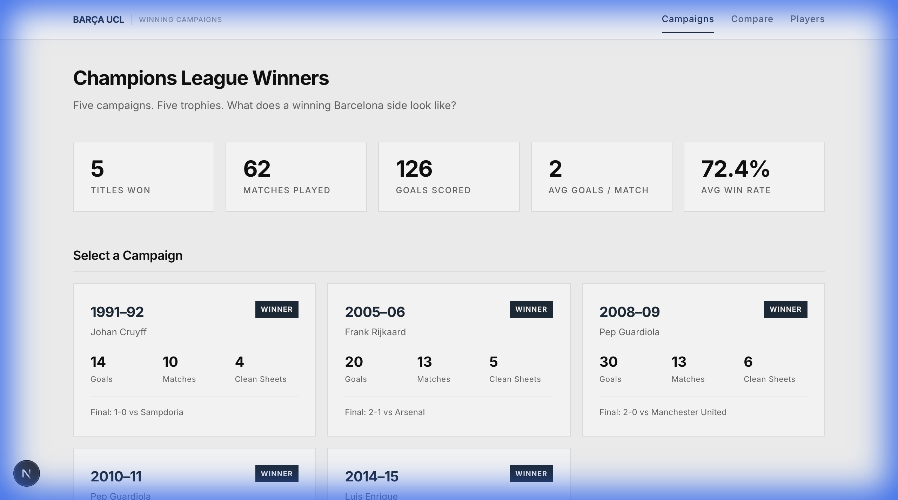
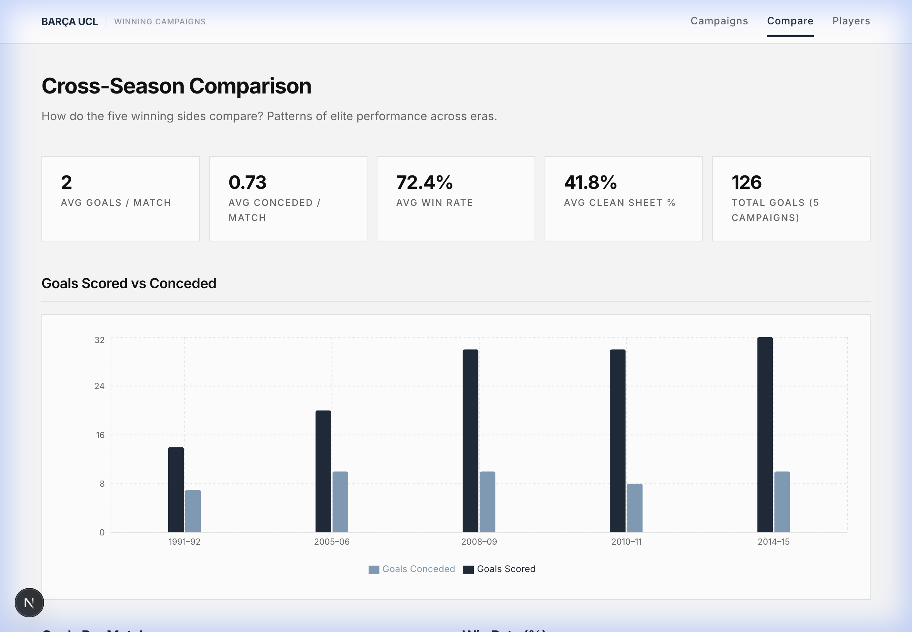
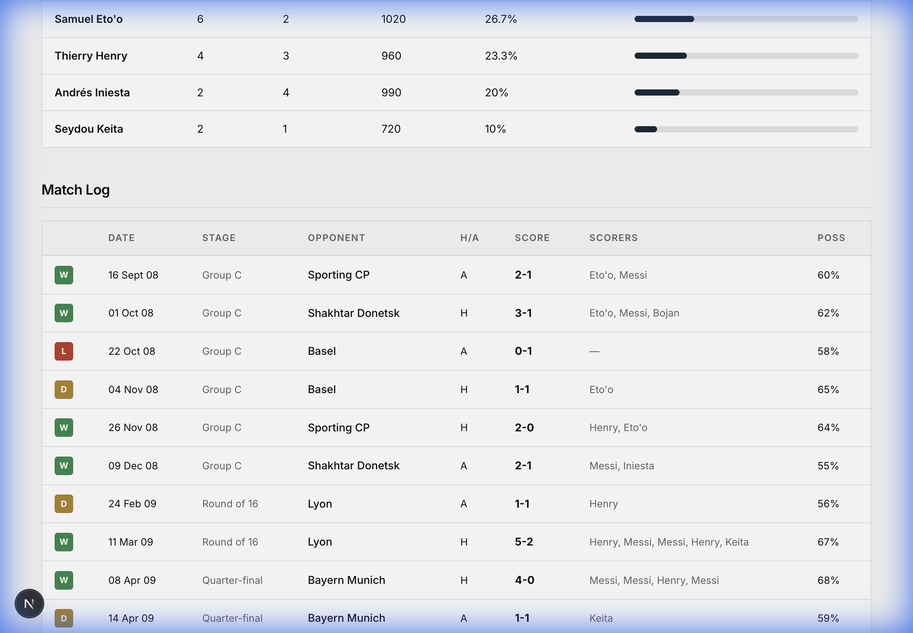

<div align="center">

# ⚽ Barça UCL Winning Campaigns

**What does a Champions League–winning Barcelona side look like?**

A data-driven analytical dashboard studying FC Barcelona's five UEFA Champions League / European Cup winning seasons.



[](https://nextjs.org/)
[](https://typescriptlang.org/)
[](https://tailwindcss.com/)
[](https://recharts.org/)
[](https://barca-ucl.vercel.app)

[**🔴 Live Demo →**](https://barca-ucl.vercel.app) · [Report Bug](https://github.com/prithvi-kaizen/barca-ucl/issues)

</div>

---

## 📖 About

This platform analyzes how Barcelona won its Champions League titles across different football eras. Instead of treating all seasons equally, it isolates the **five title-winning campaigns** to reveal patterns of elite performance through data storytelling.

### Campaigns Covered

| Season | Manager | Competition | Final Result |
|--------|---------|-------------|--------------|
| 1991–92 | Johan Cruyff | European Cup | 1-0 vs Sampdoria |
| 2005–06 | Frank Rijkaard | Champions League | 2-1 vs Arsenal |
| 2008–09 | Pep Guardiola | Champions League | 2-0 vs Man United |
| 2010–11 | Pep Guardiola | Champions League | 3-1 vs Man United |
| 2014–15 | Luis Enrique | Champions League | 3-1 vs Juventus |

---

## ✨ Features

### 🏟️ Season Deep Dive
Select any winning campaign for a complete analytical breakdown:
- Season snapshot with stat cards (goals, clean sheets, win rate, possession)
- Match dominance analysis with line and bar charts
- Home vs away performance breakdown
- Full match log with W/D/L badges and scorers

### 🏆 Knockout Journey Explorer
Step-by-step visualization from Round of 16 to the Final — aggregate scores, key contributors, and match context for every knockout tie.

### 👤 Player Contribution Engine
- Goals + assists contribution share per season
- Per-90 minutes metrics table
- Cross-campaign top scorer comparison
- Aggregated player stats across all winning campaigns

### 📊 Cross-Season Comparison
Compare all five winning teams across:
- Goals per match & goals conceded per match
- Win rate & clean sheet percentage
- Dominance Index (composite metric)
- Top scorer dependency
- Data-driven insights and observations

---

## 📸 Screenshots

<details>
<summary>Season Detail — 2008-09 (Guardiola's Treble)</summary>


</details>

<details>
<summary>Cross-Season Comparison</summary>



</details>

<details>
<summary>Match Log & Player Stats</summary>



</details>

---

## 🛠️ Tech Stack

| Layer | Technology |
|-------|-----------|
| Framework | [Next.js 16](https://nextjs.org/) (App Router) |
| Language | [TypeScript](https://typescriptlang.org/) |
| Styling | [Tailwind CSS v4](https://tailwindcss.com/) |
| Charts | [Recharts](https://recharts.org/) |
| Data Pipeline | Python 3 |
| Deployment | [Vercel](https://vercel.com/) |

---

## 🚀 Getting Started

### Prerequisites

- Node.js 18+
- Python 3.8+ (only for data regeneration)

### Installation

```bash
# Clone the repository
git clone https://github.com/prithvi-kaizen/barca-ucl.git
cd barca-ucl

# Install dependencies
npm install

# Start development server
npm run dev
```

Open [http://localhost:3000](http://localhost:3000) in your browser.

### Regenerate Dataset

The curated dataset is already included at `public/data/barca_ucl_data.json`. To regenerate it:

```bash
python3 scripts/generate_data.py
```

---

## 📁 Project Structure

```
barca-ucl/
├── public/
│   └── data/
│       └── barca_ucl_data.json    # Curated dataset (5 seasons, 62 matches)
├── scripts/
│   └── generate_data.py           # Data pipeline (real historical data)
├── src/
│   ├── app/
│   │   ├── api/                   # REST API routes
│   │   │   ├── seasons/           # GET /api/seasons
│   │   │   ├── season/[id]/       # GET /api/season/:id
│   │   │   ├── matches/[season]/  # GET /api/matches/:season
│   │   │   └── players/[season]/  # GET /api/players/:season
│   │   ├── season/[id]/           # Season detail page
│   │   ├── compare/               # Cross-season comparison
│   │   ├── players/               # Player contribution engine
│   │   ├── layout.tsx             # Root layout
│   │   ├── page.tsx               # Home / campaign selector
│   │   └── globals.css            # Design system
│   ├── components/
│   │   ├── Charts.tsx             # Recharts wrapper components
│   │   └── Navigation.tsx         # Header navigation
│   └── lib/
│       ├── data.ts                # Data loading utilities
│       └── types.ts               # TypeScript type definitions
└── docs/                          # Screenshots for README
```

---

## 📐 Analytical Metrics

| Metric | Formula |
|--------|---------|
| Per Match | `total_metric / matches_played` |
| Contribution Share | `(player_goals + assists) / team_total_goals` |
| Dominance Index | Composite of: goal diff/match (40%), win % (40%), clean sheet % (20%) |

---

## 📊 Data Integrity

> **All data is real, verifiable historical data.**

- ✅ Sourced from UEFA.com, Wikipedia, and FBref
- ✅ No synthetic, generated, or estimated values
- ✅ Missing stats (e.g., possession for 1992) explicitly marked as `null`
- ✅ Every score, scorer, and date is from documented records

---

## 🎨 Design Philosophy

- **Minimal and archival** — the interface feels like a digital research notebook
- **Data-first hierarchy** — numbers lead, decorations follow
- **No visual noise** — no gradients, no glow, no decorative sports styling
- **Color palette**: `#F7F7F7` background, `#111111` text, `#1C2A39` navy accent

---

## 📝 License

This project is open source and available under the [MIT License](LICENSE).

---

## 🙏 Acknowledgments

- **Data Sources**: UEFA.com, FBref, Wikipedia
- **Charting**: Recharts
- **Framework**: Next.js by Vercel

---

<div align="center">

**Built with ❤️ for football analytics**

*Visca el Barça!*

</div>
